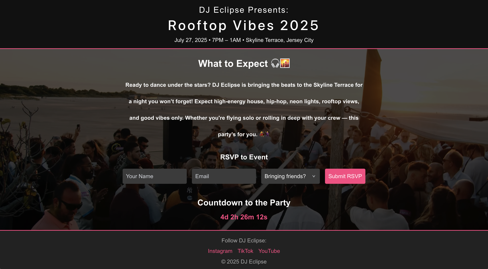

#  DJ Event Landing Page – Rooftop Vibes 2025

Live Demo: [Visit Site](https://inquisitive-sundae-8f7df3.netlify.app/)

This is a responsive, modern landing page built for a live DJ event titled "Rooftop Vibes 2025". Designed with both aesthetics and functionality in mind, it provides essential event details, encourages RSVPs, and reflects a vibrant yet professional brand presence.

Ideal for DJs, event planners, and entertainment professionals seeking a stylish digital footprint.

---

## Features

- **Hero Section**: Bold intro with date, time, and location.
- **About the Event**: Highlights music genres, ambiance, and vibe.
- **RSVP Form**: Guests can RSVP directly, including how many people they’re bringing.
- **Google Sheets Integration**: Submissions are stored in a linked Google Sheet via Apps Script.
- **Live Countdown**: Real-time countdown timer until the event starts.
- **Responsive Design**: Clean layout for desktop and mobile (mobile responsiveness in progress).
- **Stylized Footer**: Social media links for easy following.

---

## Technologies Used

### Frontend
- React
- Tailwind CSS
- JavaScript (ES6+)
- HTML5

### Backend
- Google Apps Script Webhook (Google Sheets integration)
- Fetch API for POST requests

### DevOps & Security
- GitHub for version control
- Netlify for deployment
- CORS proxy for development-only cross-origin request handling
- Basic client-side validation for form inputs

---

## Screenshots

Here's a preview of the event page:

*An engaging overview with links to key sections.*

---

## Contact

This project is a sample of freelance work that can be tailored to your brand, event, or product. Reach out if you'd like a site like this designed for your next party, conference, or launch!

- **LinkedIn**: [My LinkedIn](https://www.linkedin.com/in/chelsea-ramdat)
- **GitHub**: [My GitHub](https://github.com/ChelsR29)
- **Portfolio**: [My Portfolio](https://chelsea-react-portfolio.netlify.app/)
